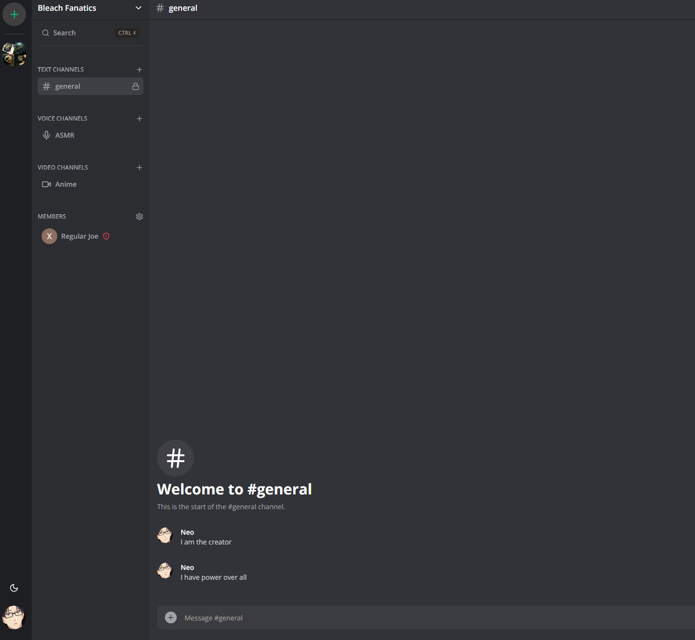
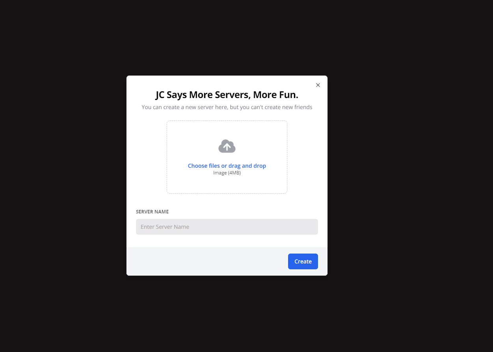
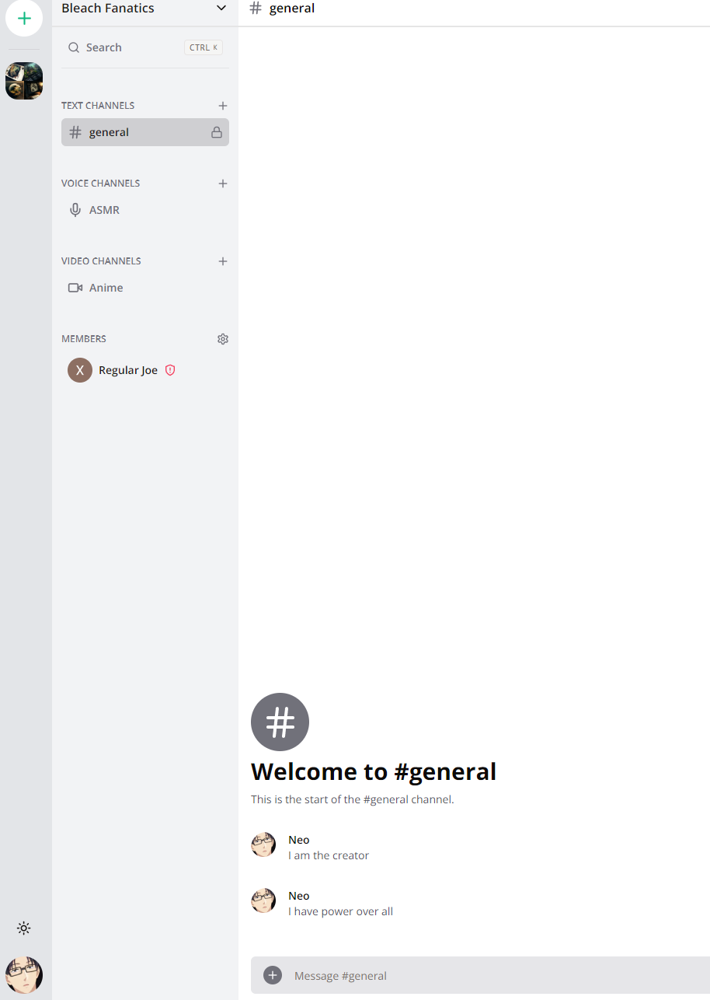
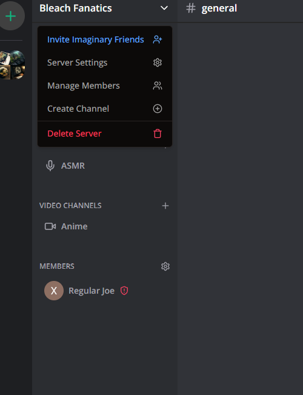
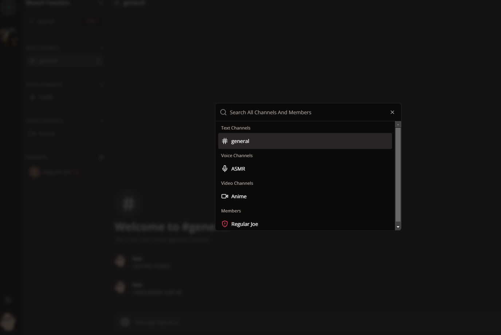

## Getting Started

First, run the development server:

```bash
npm run dev
# or
yarn dev
# or
pnpm dev
```


Open [http://localhost:3000](http://localhost:3000) with your browser to see the result.

You can start editing the page by modifying `app/page.tsx`. The page auto-updates as you edit the file.


## What Is This
This is a  Discord Clone Application built using Next 13, React, Tailwind, Prisma, PlanetScale, Clerk, Typescript, and 
Socket.IO. It supports live messages updates, creating servers, adding users to servers, search, as well as creating channels.







